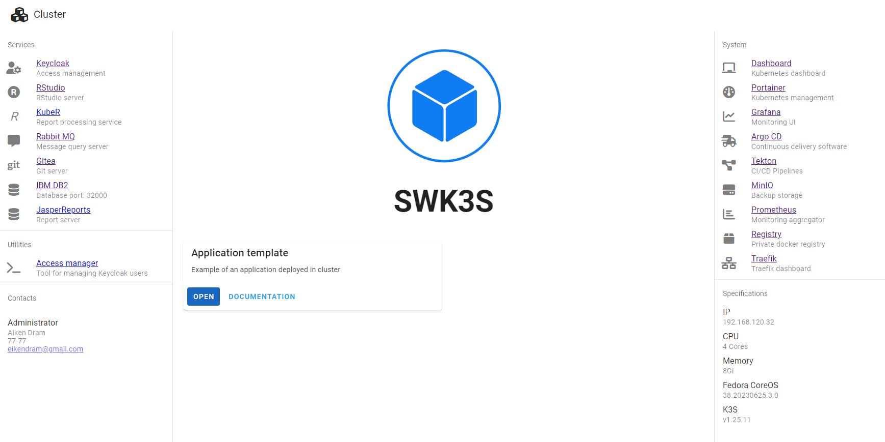

# KubeHome

A simple vue + vuetify home page for a kubernetes cluster for [KubeBuild](https://github.com/EikenDram/kube-build) project, based on vue+vuetify



Docker image is published to [ghcr.io/eikendram/kube-home](https://github.com/EikenDram/kube-home/pkgs/container/kube-home)

Helm chart is available from [https://eikendram.github.io/kube-charts](https://github.com/EikenDram/kube-charts)

## Configuration

Application reads content of `.json` files in `content` directory:

### apps.json

Array of applications:

```json
[
  {
    "name": "Application name",
    "desc": "Application description",
    "url": "Application link",
    "docs": "Documentation link",
    "image": {
      "height": "Height of image, 250 is default",
      "src": "Image source"
    }
  }
]
```

### cluster.json

Home page configuration:

```json
{
  "name": "Name of cluster",
  "contacts": [
    {
      "title": "Contact title",
      "name": "Contact name",
      "phone": "Contact phone",
      "mail": "Contact email",
      "avatar": {
        "image": "Avatar image source"
      }
    }
  ],
  "specs": [
    {
      "name": "Specification name",
      "value": "Specification value"
    }
  ],
  "services": [
    {
      "name": "Service name",
      "desc": "Service description",
      "url": "Service url",
      "icon": "Service icon"
    }
  ],
  "utils": [
    {
      "name": "Utilities name",
      "desc": "Utilities description",
      "url": "Utilities url",
      "icon": "Utilities icon"
    }
  ],
  "system": [
    {
      "name": "System name",
      "desc": "System description",
      "url": "System url",
      "icon": "System icon"
    }
  ]
}
```

### locale.json

Localization configuration:

```json
{
  "app": "Application bar name",
  "utils": "Utilities",
  "open": "Open",
  "docs": "Documentation",
  "services": "Services",
  "contacts": "Contacts",
  "system": "System",
  "specs": "Specifications"
}
```

### logo.json

Logo configuration

```json
{
  "url": "Logo url",
  "height": "Logo height"
}
```

## Project setup

```
# yarn
yarn

# npm
npm install

# pnpm
pnpm install
```

### Compiles and hot-reloads for development

```
# yarn
yarn dev

# npm
npm run dev

# pnpm
pnpm dev
```

### Compiles and minifies for production

```
# yarn
yarn build

# npm
npm run build

# pnpm
pnpm build
```

### Lints and fixes files

```
# yarn
yarn lint

# npm
npm run lint

# pnpm
pnpm lint
```

### Customize configuration

See [Configuration Reference](https://vitejs.dev/config/).
